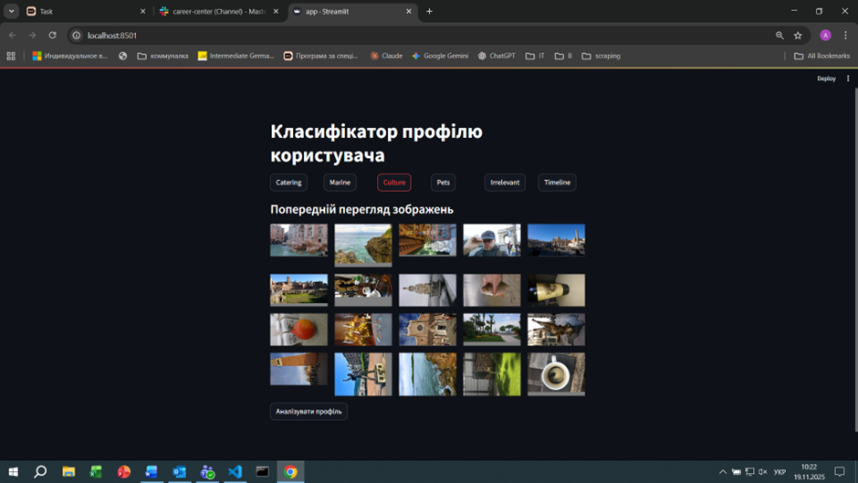
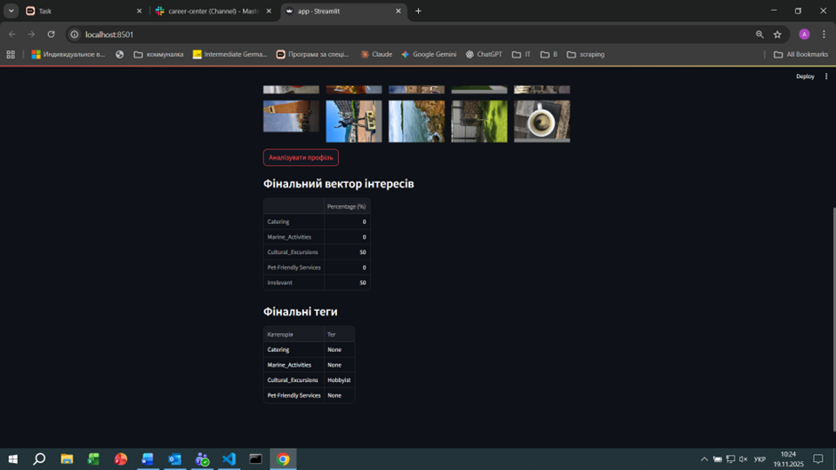
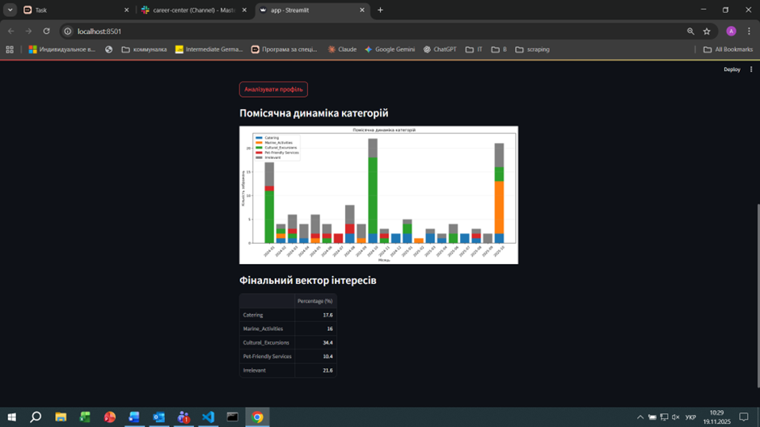

# Звіт №5: Розробка прототипу системи класифікації профілів користувачів

## 1. Мета роботи

Розробка повнофункціонального прототипу системи класифікації профілів користувачів соціальних мереж на основі візуального контенту з використанням модульної архітектури та інтерактивного веб-інтерфейсу.

## 2. Завдання

1. Розробка модульної архітектури pipeline для аналізу профілів
2. Реалізація CLI-скрипту 
3. Створення інтерактивного веб-додатку (Streamlit)
4. Інтеграція результатів досліджень Етапів 3-4 (пороги, коефіцієнти корекції)
5. Тестування системи на підготовлених датасетах

## 3. Архітектура системи

### 3.1. Модульний Pipeline (`profile_pipeline.py`)

Розроблено п'ятикомпонентну архітектуру обробки профілів:

#### Модуль 1: SigLIPClassifier
- **Призначення**: Zero-shot класифікація зображень
- **Вхід**: PIL Image
- **Вихід**: Raw scores для 5 категорій
- **Модель**: google/siglip-base-patch16-224
- **Промпти**: Ідентичні Етапам 2-4 для забезпечення порівнянності

#### Модуль 2: ThresholdFilter
- **Призначення**: Порогова фільтрація на рівні зображення
- **Вхід**: Raw scores від SigLIPClassifier
- **Вихід**: Назва категорії
- **Логіка**: Якщо бізнес-категорія має score < 0.000010 → перекласифікація як "Irrelevant"
- **Константа**: FILTER_THRESHOLD = 0.000010 (Етап 3)

#### Модуль 3: ProfileAggregator
- **Призначення**: Агрегація результатів на рівні профілю
- **Вхід**: Список категорій для всіх зображень профілю
- **Вихід**: Фактичні відсотки кожної категорії
- **Логіка**: Підрахунок частки кожної категорії в профілі

#### Модуль 4: HierarchicalTagger
- **Призначення**: Присвоєння ієрархічних тегів
- **Вхід**: Фактичні % після агрегації ("брудні" дані)
- **Вихід**: Теги для кожної бізнес-категорії
- **Пороги**:
  - Hobbyist: ≥27.5%
  - User: ≥12.8%
  - None: <12.8%

#### Модуль 5: NoiseFilter
- **Призначення**: Фільтрація шуму, валідація тегів, recall корекція
- **Вхід**: Raw counts, tags, total_images
- **Вихід**: Validated tags, final percentages (100% нормалізація)
- **Логіка**:
  1. Перевірка мінімальних порогів (DETECTION_THRESHOLDS)
  2. Скидання тегів для категорій з недостатньою кількістю зображень
  3. Recall корекція (RECALL_FACTORS) з округленням
  4. 100% нормалізація фінального вектору

### 3.2. Константи з досліджень

**FILTER_THRESHOLD** (Етап 3):
```python
FILTER_THRESHOLD = 0.000010
```

**DETECTION_THRESHOLDS** (Етап 4, Reliable N):
```python
DETECTION_THRESHOLDS = {
    'Catering': 5,
    'Marine_Activities': 3,
    'Cultural_Excursions': 4,
    'Pet-Friendly Services': 2
}
```

**RECALL_FACTORS** (Етап 4, mean/10 для N=10):
```python
RECALL_FACTORS = {
    'Catering': 0.872,
    'Marine_Activities': 0.758,
    'Cultural_Excursions': 0.887,
    'Pet-Friendly Services': 0.772
}
```

**TAGGER_THRESHOLDS**:
```python
TAGGER_THRESHOLDS = {
    'Hobbyist': 0.275,  # 27.5%
    'User': 0.128       # 12.8%
}
```

## 4. CLI-скрипт (`analyze_user_profile_stage_5.py`)

### 4.1. Функціонал

- Використання модульного pipeline
- Генерація детальних результатів з image_details
- Побудова помісячної динаміки категорій
- Збереження результатів у JSON

### 4.2. Вхідні дані

```
data/stage_5/{profile}/
├── *.jpg                      # Зображення профілю
└── image_timestamps.json      # Часові мітки
```

### 4.3. Вихідні дані

```
results/stage_5/{profile}/
├── profile_analysis.json      # Повні результати аналізу
└── monthly_dynamics.png       # Графік помісячної динаміки
```

### 4.4. Структура результатів

```json
{
  "total_images": 125,
  "raw_counts": {"Catering": 19, ...},
  "factual_percentages": {"Catering": 15.2, ...},
  "tags": {"Catering": "User", ...},
  "validated_tags": {"Catering": "User", ...},
  "final_percentages": {"Catering": 17.6, ...},
  "image_details": {
    "img1.jpg": {
      "raw_scores": {"Catering": 0.00456789, ...},
      "filtered_category": "Catering"
    }
  },
  "monthly_dynamics": {...}
}
```

## 5. Веб-додаток (`app.py`)

### 5.1. Архітектура

- **Фреймворк**: Streamlit
- **Оптимізації**: 
  - `st.session_state` для збереження завантажених зображень
  - `st.cache_resource` для кешування моделі
- **Режими роботи**:
  - Повний (full): обробка через ProfilePipeline
  - Швидкий (fast): завантаження готових результатів

### 5.2. Підтримувані профілі

| Профіль | Режим | Дата-папка | Результати |
|---------|-------|------------|------------|
| Catering | Full | data/stage_5/cat | results/stage_5/cat |
| Marine | Full | data/stage_5/mar | results/stage_5/mar |
| Culture | Fast | data/stage_5/cul | results/stage_5/cul |
| Pets | Fast | data/stage_5/pet | results/stage_5/pet |
| Irrelevant | Fast | data/stage_5/irr | results/stage_5/irr |
| Timeline | Fast | data/stage_5/base | results/stage_5/base |

### 5.3. Інтерфейс

**Стартова сторінка:**
- 6 кнопок профілів

**Після вибору профілю:**
- Попередній перегляд (перші 20 зображень)
- Кнопка "Аналізувати профіль"

**Вивід результатів:**

Для Timeline:
1. Графік "Помісячна динаміка категорій" (stacked bar chart)
2. Таблиця "Фінальний вектор інтересів"

Для інших профілів:
1. Таблиця "Фінальний вектор інтересів"
2. Таблиця "Фінальні теги"

## 6. Тестування

### 6.1. Тестові профілі

Підготовлено 6 тестових профілів:
- **cat**: 20 зображень Catering
- **mar**: 20 зображень Marine Activities
- **cul**: 20 зображень Cultural Excursions
- **pet**: 20 зображень Pet-Friendly Services
- **irr**: 20 зображень Irrelevant
- **base**: 125 зображень (довгий період, січень 2024 - жовтень 2025)

### 6.2. Результати тестування

Робота з веб-додатком починається із завантаження семплу зображень, що дає початкове уявлення про аналізуємий профіль (для демонстрації надано власні зображення)



Далі система дозволяє працювати в двох режимах.

1.	Швидкий аналіз невеликих семплів (20-50шт.) зображень на предмет виявлення інтересів і присвоєння відповідних тегів профілю користувача



2.	У випадку більшої кількості зображень система дозволяє побудувати візуалізацію динаміки інтересів в часі, що дає додаткові можливості для аналізу даних та пропозиції послуг. Можливі параметри - актуальність послуги в даний момент, періодичність послуги, найкраще вікно для пропозиції. 

Кейс “Timeline” побудовано на 125 зображеннях, розмічених впродовж 2х років



Тут ми вже бачимо чіткі періоди інтересів до екскурсій та морських розваг, пов’язані з подорожами. Можемо далі досліджувати відповідні тематики подорожей для визначення найкращого часового проміжку для пропозиції. А також можемо оцінити актуальність, чи як у випадку “Pet-careServices”, -  неактуальність пропозиції.

## 7. Структура проекту

```
code/
├── model/
│   └── stage_5/
│       └── profile_pipeline.py          # Модульний pipeline
├── data/
│   └── stage_5/
│       ├── cat/                         # Catering профіль
│       ├── mar/                         # Marine профіль
│       ├── cul/                         # Culture профіль
│       ├── pet/                         # Pets профіль
│       ├── irr/                         # Irrelevant профіль
│       └── base/                        # Timeline профіль
├── results/
│   └── stage_5/
│       ├── cat/                         # Результати Catering
│       ├── mar/                         # Результати Marine
│       ├── cul/                         # Результати Culture
│       ├── pet/                         # Результати Pets
│       ├── irr/                         # Результати Irrelevant
│       ├── base/                        # Результати Timeline
│       └──analyze_user_profile_stage_5.py      # CLI-скрипт
└── app.py                                # Веб-додаток
```

## 8. Висновки

1. Розроблено повнофункціональну модульну систему класифікації профілів користувачів
2. Успішно інтегровано результати досліджень Етапів 3-4 (пороги, коефіцієнти)
3. Реалізовано два режими роботи: CLI та веб-інтерфейс для інтерактивного аналізу
4. Система коректно обробляє різні типи профілів та генерує статистично обґрунтовані результати
5. Впроваджено механізми валідації тегів та recall корекції для усунення статистичного зміщення
6. Створено зручний інтерфейс з попереднім переглядом зображень та візуалізацією результатів
